# 2×5 URA Panel — What the Simulation Found

**Array:** 10 hydrophones, 2 × 5 uniform rectangular array, uniform separation **d = 0.83 m**, back-baffled, upright, facing azimuth 0°
**Design point:** f₀ = 904 Hz (where d = λ/2), processing band 100–900 Hz, c = 1500 m/s
**Date:** 2026-10-04 · **Source:** `Testbenches/URA2x5_Beamformed.ipynb` (ideal conditions)

---

## How to read this document

This covers the **ideal-condition baseline** only: perfect elements, spatially white noise, c = 1500 m/s everywhere, far-field sources, no multipath and no host platform. It is the **upper bound** and the regression suite — 26 closed-form results are asserted on every notebook run. It is **not** a performance prediction.

A realistic-conditions revision (correlated ocean noise, channel errors, ADC skew, heading, multipath, a real detector) has been done for the sibling **9-element ring** in `BEAMFORM_LEN` and is the obvious next step here; the shared `ura2x5/` core already carries those modules.

Every figure was generated by `docs/make_figures.py` from the same core and `config.yaml` the notebook uses. To reproduce:

```bash
python docs/make_figures.py     # writes docs/images/ and docs/figure_values.json
```

> **Confidence grading.** Results below are **measured** (falls out of geometry or closed-form theory — trustworthy) unless marked otherwise. The one **placeholder-limited** input is the baffle's front-to-back rejection, flagged where it matters.

---

## The short version

| | Finding | § |
|---|---|---|
| 1 | Sidelobes **−12.0 dB**, beamwidth **20.6°** — both roughly twice as good as the ring | [2](#2-beam-pattern-at-broadside) |
| 2 | **Tapering works here** (−33.6 dB) where on a ring it actively hurts | [7](#7-amplitude-taper--it-works-on-a-ura) |
| 3 | **d = 0.83 m is the binding constraint**: alias-free only to 904 Hz, vs 1754 Hz for the ring | [9](#9-spatial-aliasing--two-thresholds-not-one) |
| 4 | Coverage is **±45° of one face** — about four baffled panels for 360° | [8](#8-steering--broadening-and-the-usable-sector) |
| 5 | Front/back ambiguity is **exact**; the baffle is load-bearing, not a detail | [3](#3-the-back-baffle) |
| 6 | **The band where everything works at once is only 605–904 Hz** | [13](#13-the-band-that-actually-works) |

---

# Part 1 — Geometry and the ideal beam

## 1. Geometry

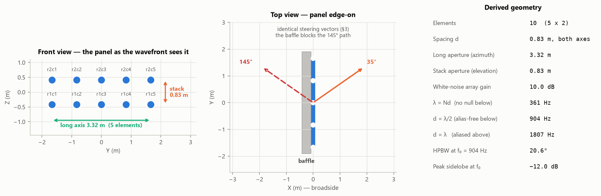

Ten elements on a 0.83 m grid, 5 across by 2 high, standing upright in the Y–Z plane with broadside at azimuth 0°. Three numbers follow from the geometry alone and govern everything else:

| Threshold | Value | Meaning |
|---|---|---|
| λ = Nd | **361 Hz** | below this the aperture is shorter than a wavelength — no null exists |
| d = λ/2 | **904 Hz** | below this, alias-free at **any** steering angle |
| d = λ | **1807 Hz** | above this, grating lobes **even at broadside** |

The two axes behave completely differently. The **long axis** (3.32 m, 5 elements) is the azimuth aperture and does the real work. The **stack** (0.83 m, 2 elements) cannot form a vertical beam in any meaningful sense — but it does something useful anyway (§4).

## 2. Beam pattern at broadside

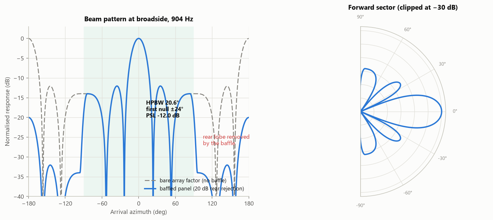

| Quantity | Value | Comment |
|---|---|---|
| Half-power beamwidth | **20.6°** | theory 0.886 λ/Nd = 20.3° |
| First null | **±23.6°** | theory arcsin(λ/Nd) = 23.57° |
| Peak sidelobe | **−12.0 dB** | long uniform line → −13.2 dB; 5 elements fall slightly short |
| White-noise array gain | **10.0 dB** | 10 log₁₀(10) |

The dashed grey curve is the bare array factor, which has a **second, equal lobe behind the panel**. The baffle removes it: rear response drops from 0.0 dB to **−19.2 dB**. Inside the forward sector the baffle is unity, so every metric in this document is identical with or without it — asserted both ways in the notebook.

## 3. The back baffle

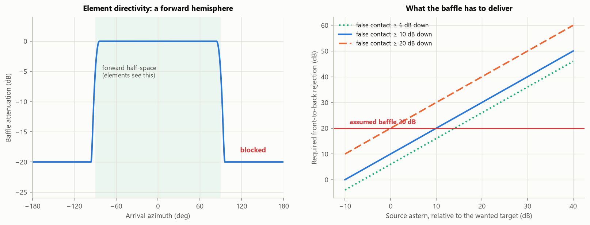

The elements cannot see behind, so each is a forward-hemisphere receiver and the array is a **±90° forward sensor**. That is the end of the matter for real sources.

What remains is a property of the *mathematics*, and the two statements below look contradictory but are both true:

| | |
|---|---|
| Response vs **arrival** direction | rear **suppressed** — nothing behind is heard |
| **Scan** of a source ahead | still shows a second peak at 180° − φ |

Reflecting through the panel plane maps φ → 180° − φ and leaves **every path length unchanged**, so `a(145°)` and `a(35°)` are *the same vector* — verified to 1.3 × 10⁻¹⁵. Steering to 145° therefore computes the same number, from the same data, as steering to 35°. A source at 35° paints both peaks — not because anything is behind the panel, but because *looking* behind is arithmetically identical to looking ahead.

**The fix is to not scan behind.** Restricting the display to ±90° removes the artifact; the baffle is what makes that restriction *correct*, by guaranteeing a strong forward peak really came from ahead.

### How much rejection is needed

⚠️ **Placeholder.** 20 dB is a typical figure for a competent sonar baffle; the installed value must be measured, **and measured across the band** — real baffles lose rejection at low frequency, exactly where this array already has the least azimuth discrimination.

| Source astern is | False contact appears at | vs the −12.0 dB sidelobe floor |
|---|---|---|
| +0 dB | −20 dB | buried in sidelobes |
| +10 dB | −10 dB | **visible** |
| +20 dB | 0 dB | **visible** |
| +30 dB | +10 dB | **visible** |

**Requirement: FBR ≥ (loudest plausible source astern, relative) + (wanted margin).** To keep a ship 20 dB louder astern at least 10 dB below the wanted target needs **≥ 30 dB**, not the 20 dB assumed here.

### What the baffle is worth, measured

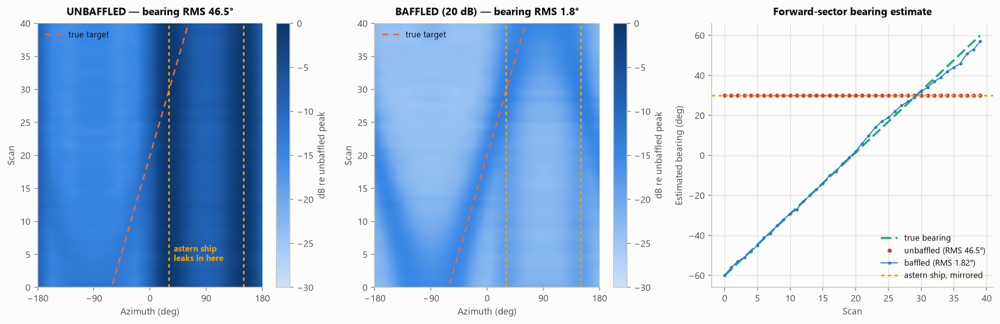

A ship crosses the forward sector from −60° to +60° at 0 dB SNR, while a **louder ship sits astern at 150°** — whose mirror bearing, 30°, lands inside the forward sector.

| | Astern ship arrives at | Bearing RMS |
|---|---|---|
| Unbaffled | +15 dB | **46.5°** |
| Baffled (20 dB) | −5 dB | **1.8°** |

Unbaffled, the estimate is captured on **every** scan by a ship that is not even on this side of the panel. Both BTR panels share one colour scale, so the level drop between them is the baffle working, not a change of normalisation.

## 4. Vertical response and the zenith null

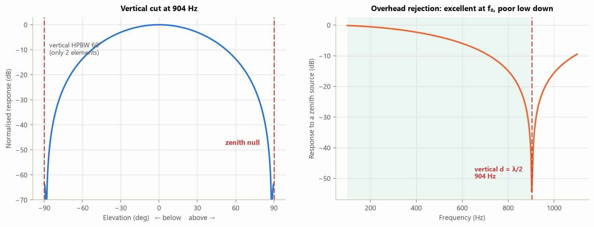

Two elements cannot form a vertical beam — the pattern is the interferometer cos(½kd sin θ), **59.8°** wide and still **up/down symmetric** (asserted to 3.6 × 10⁻¹⁵). Like the ring, the panel cannot tell above from below.

But at the frequency where the *vertical* spacing is λ/2, the two rows are exactly π out of phase for a zenith arrival and the sum vanishes:

| | 300 Hz | f₀ = 904 Hz |
|---|---|---|
| Response to a source directly overhead | **−1.2 dB** | **−63.5 dB** |

This matters because overhead host noise is the dominant problem for the ring, which leaks it into every beam at −1.4 dB at 300 Hz. **The panel is far better at the top of its band and no better at the bottom** — the null is a narrowband consequence of the vertical spacing, not a broadband property of the geometry.

## 5. Resolution

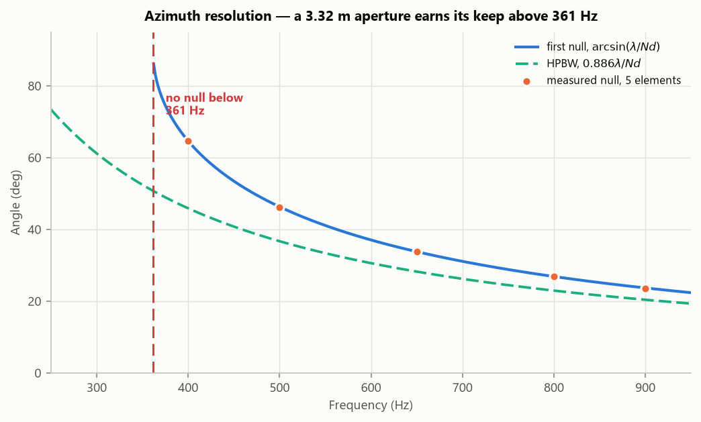

A 3.32 m aperture resolves roughly twice as finely as the ring's 1.25 m — 23.6° first null at f₀ against the ring's 45°. Unlike the ring, whose null simply *ceases to exist* below 459 Hz, a line aperture always has one as long as λ ≤ Nd. For this panel that holds down to **361 Hz**.

## 6. Broadband processing

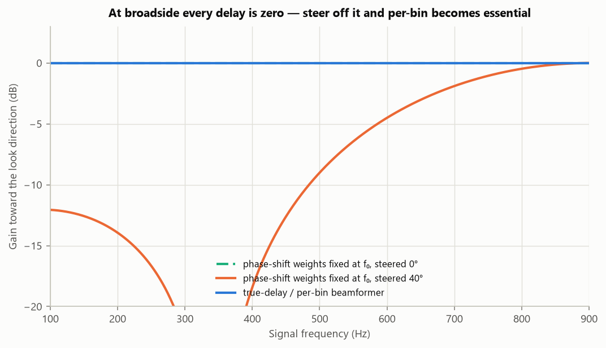

A phase shift computed at f₀ is only correct at f₀. **At broadside this costs nothing** — every required delay is zero, so there is nothing to get wrong. Steered 40° off broadside the loss is real, and any operational system steers.

**Beamform per FFT bin.** True-delay or per-bin processing holds unit gain at every frequency by construction.

---

# Part 2 — The three design levers

## 7. Amplitude taper — it works on a URA

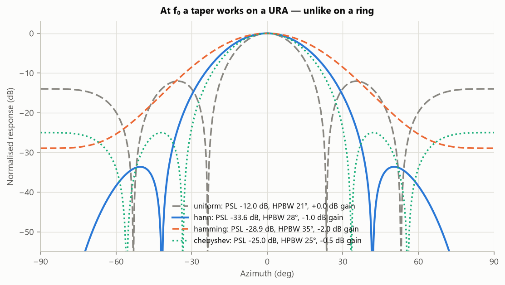

**The clearest behavioural difference from the ring.** On a ring the aperture edge depends on look direction and sidelobes come from the J₀ shape of the whole circle, so conventional tapers made things measurably *worse* (−7.9 dB → −3.7 dB). A URA has fixed physical edges, so a window along the long axis behaves exactly as the textbook says:

| Taper | HPBW | Peak sidelobe | WNG cost |
|---|---|---|---|
| Uniform | 20.6° | −12.0 dB | 0.00 dB |
| **Hann** | 27.8° | **−33.6 dB** | **−0.97 dB** |
| Hamming | 35.0° | −28.9 dB | −2.02 dB |
| Chebyshev (25 dB) | 25.0° | −25.0 dB | −0.53 dB |

Hann buys **21.6 dB of sidelobe suppression for about 1 dB of array gain**. Sidelobe control is a solved problem on this panel; on the ring it needs phase-mode weighting.

## 8. Steering — broadening and the usable sector

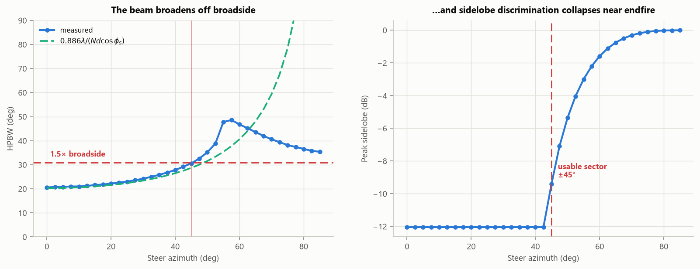

A ring has no broadside: steering rotates an identical pattern, giving 360° at constant performance. A planar array's effective aperture shrinks as cos φₛ, so the beam broadens as 0.886 λ/(Nd cos φₛ) and degenerates near endfire, where azimuth maps onto sin φ and stops changing.

| Steer | 0° | 20° | 40° | 50° | 60° |
|---|---|---|---|---|---|
| HPBW | 20.6° | 22.2° | 27.8° | 35.2° | 46.8° |
| Peak sidelobe | −12.0 dB | −12.0 dB | −12.0 dB | −5.4 dB | −1.6 dB |

**Usable sector ≈ ±45°** (HPBW within 1.5× broadside). Beyond it the sidelobe floor climbs toward 0 dB.

> **Coverage consequence:** one panel covers ~90° of the horizon at full performance, on one face only. Full 360° needs about **four baffled panels**, against a single ring that does it with nine elements.

## 9. Spatial aliasing — two thresholds, not one

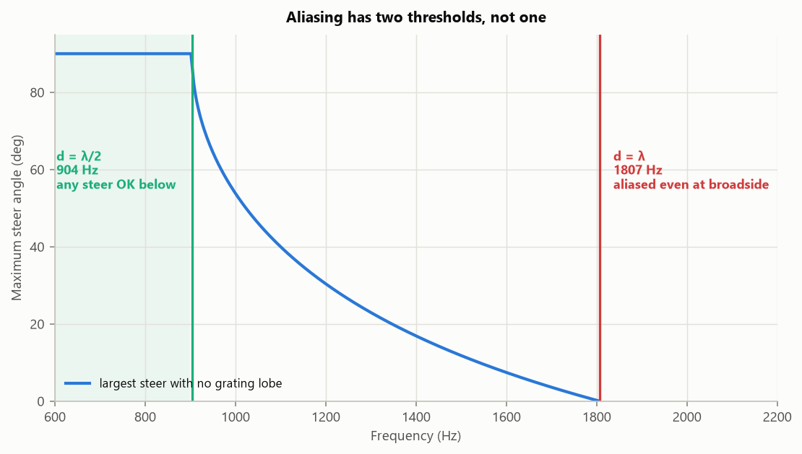

0.83 m is nearly twice the ring's 0.4275 m chord, which makes spatial sampling this array's binding constraint. The usual "d ≤ λ/2" statement hides that a grating lobe appears when sin φ_g = sin φₛ ± λ/d, so the limit depends on **both** frequency and steer angle:

| Regime | Band | Condition |
|---|---|---|
| Alias-free at **any** steer | below **904 Hz** | d ≤ λ/2 |
| Alias-free at **broadside only**, shrinking steer sector | 904 – **1807 Hz** | max steer arcsin(λ/d − 1) |
| Aliased **even at broadside** | above **1807 Hz** | d ≥ λ |

Measured peak counts track the analytic limit exactly — an extra peak appears in the forward sector precisely when the steer angle passes arcsin(λ/d − 1). This is why the processing band stops at 900 Hz.

---

# Part 3 — The whole band, three ways

The same ten frequencies, steered to broadside, processed three ways. Together they bound where this array is actually good.

## 10. DAS across frequency

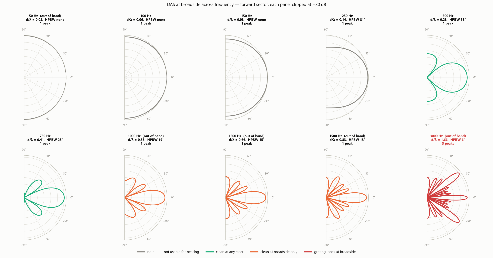

| f (Hz) | λ (m) | d/λ | HPBW | First null | PSL | Peaks | Regime |
|---|---|---|---|---|---|---|---|
| 50 | 30.00 | 0.03 | — | — | — | 1 | no discrimination |
| 100 | 15.00 | 0.06 | — | — | — | 1 | no discrimination |
| 150 | 10.00 | 0.08 | — | — | — | 1 | no discrimination |
| 250 | 6.00 | 0.14 | 81.0° | — | — | 1 | no discrimination |
| 500 | 3.00 | 0.28 | 37.8° | 46.2° | −12.2 dB | 1 | **clean, any steer** |
| 750 | 2.00 | 0.41 | 25.0° | 28.8° | −12.0 dB | 1 | **clean, any steer** |
| 1000 | 1.50 | 0.55 | 18.6° | 21.2° | −12.0 dB | 1 | clean at broadside only |
| 1200 | 1.25 | 0.66 | 15.4° | 17.6° | −12.0 dB | 1 | clean at broadside only |
| 1500 | 1.00 | 0.83 | 12.6° | 14.0° | −12.0 dB | 1 | clean at broadside only |
| 3000 | 0.50 | 1.66 | 6.2° | 7.0° | **−0.0 dB** | **3** | **aliased at broadside** |

At 50 Hz the forward sector is essentially one broad lobe — those bins carry energy for *detection* but almost no bearing information. At 3 kHz the array reports **three targets of near-equal strength** where one exists; 1000–3000 Hz are outside the processing band and are plotted precisely to show what the anti-alias filter is for.

## 11. MVDR across frequency

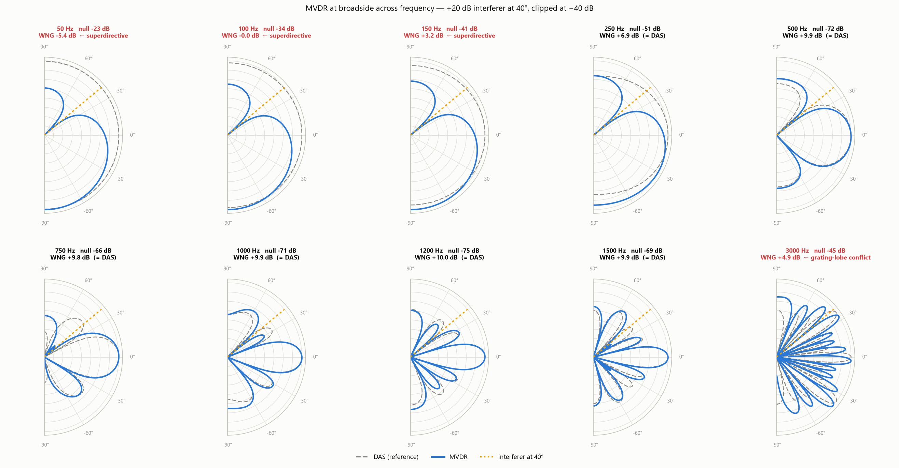

MVDR needs something to adapt to — against white noise it reduces *exactly* to DAS. There is therefore a **+20 dB interferer at 40°**, and the question is not whether it can null it (it always can) but **what nulling costs**.

The cost is invisible in the pattern. It is **white-noise gain**, WNG = 1/(wᴴw), the gain against uncorrelated per-element noise. Uniform DAS always achieves 10 log₁₀(N) = 10.0 dB.

| f (Hz) | Null at 40° | WNG | vs DAS | Verdict |
|---|---|---|---|---|
| 50 | −22.6 dB | **−5.4 dB** | 15.4 dB worse | superdirective |
| 100 | −34.2 dB | −0.0 dB | 10.0 dB worse | superdirective |
| 150 | −41.3 dB | +3.2 dB | 6.8 dB worse | superdirective |
| 250 | −50.7 dB | +6.9 dB | 3.1 dB worse | acceptable |
| 500 | −71.6 dB | **+9.9 dB** | 0.1 dB | **free** |
| 750 | −66.1 dB | +9.8 dB | 0.2 dB | **free** |
| 1000 | −70.7 dB | +9.9 dB | 0.1 dB | **free** |
| 1200 | −75.4 dB | +10.0 dB | 0.0 dB | **free** |
| 1500 | −68.9 dB | +9.9 dB | 0.1 dB | **free** |
| 3000 | −45.4 dB | +4.9 dB | 5.1 dB worse | grating-lobe conflict |

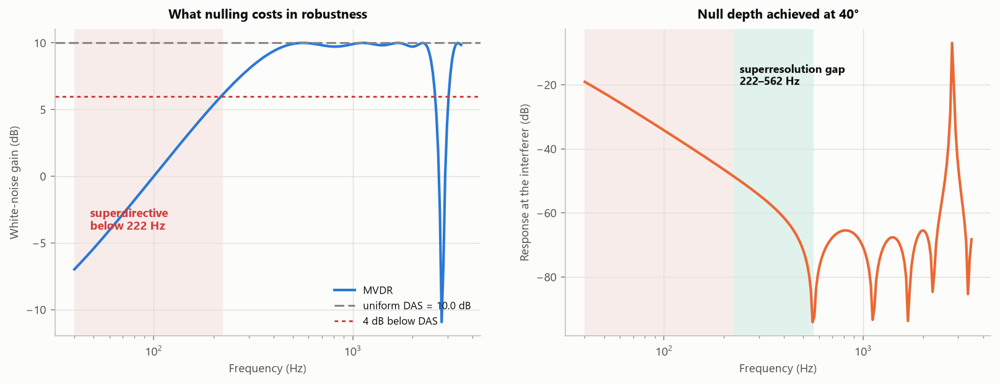

**At the low end MVDR nulls only by going superdirective** — large near-cancelling weights that look fine on paper and would not survive real channel errors. A low WNG is the warning that the pattern shown is **not achievable on hardware**.

**The useful result is a gap.** Three frequencies, and the distances between them are the point:

| | |
|---|---|
| **229 Hz** | the interferer reaches the conventional half-power point |
| **222 Hz** | MVDR's WNG penalty drops below 4 dB — *measured* |
| **562 Hz** | the conventional first null finally reaches the interferer |

MVDR becomes affordable at ~222 Hz, tracking the half-power point to within 3%, and that is **2.5× below** the 562 Hz at which DAS can null the interferer at all. Between 222 and 562 Hz MVDR places a 50–70 dB null on an interferer DAS cannot resolve, essentially for free. **That gap is the case for going adaptive.**

The 3 kHz penalty has a *different* cause despite the same symptom: the interferer sits near a grating-lobe replica of the look direction, so nulling it fights the main lobe.

## 12. Taper across frequency

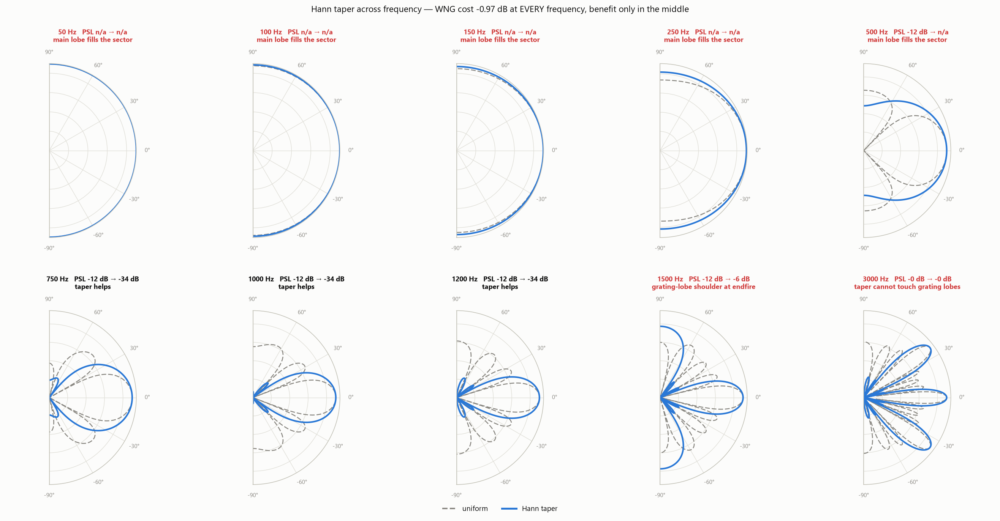

§7 tested taper at one frequency. Sweeping it shows the useful band is **narrower than the array's own clean band**, and fails at each end for a different reason.

The weights are fixed numbers on fixed elements, so the **WNG cost is frequency-independent** — you pay Hann's 0.97 dB everywhere, including where you get nothing back.

| f (Hz) | PSL uniform | PSL Hann | Change | Outcome |
|---|---|---|---|---|
| 50–250 | — | — | — | no sidelobe structure at all |
| 500 | −12.2 dB | — | — | Hann main lobe fills the sector |
| 750 | −12.0 dB | **−33.6 dB** | −21.6 dB | **taper helps** |
| 1000 | −12.0 dB | **−33.6 dB** | −21.6 dB | **taper helps** |
| 1200 | −12.0 dB | **−33.6 dB** | −21.6 dB | **taper helps** |
| 1500 | −12.0 dB | −6.3 dB | **+5.8 dB** | grating-lobe shoulder at endfire |
| 3000 | −0.0 dB | −0.0 dB | 0.0 dB | **taper cannot touch grating lobes** |

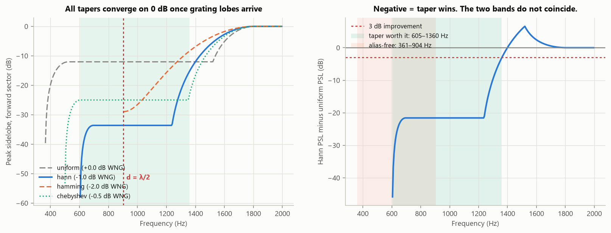

**A taper is useless against aliasing.** A grating lobe is a full-height *replica of the main lobe*, not a sidelobe — the taper shapes the main lobe and every replica identically, so the replica stays at 0 dB. In the left-hand panel all four tapers converge on 0 dB above ~1700 Hz.

**Above ~1400 Hz it is worse than useless.** Widening the main lobe widens the replica too, pulling grating-lobe energy into view *earlier* than uniform. The +5.8 dB penalty at 1500 Hz traces to a peak sidelobe sitting at ±88° — the incipient grating lobe at the sector edge, where uniform is −15.1 dB and Hann is −6.3 dB.

## 13. The band that actually works

Three bands, derived independently, and they do **not** coincide:

| Band | Range |
|---|---|
| Alias-free at any steer | 361 – 904 Hz |
| Taper worth its gain cost | 605 – 1360 Hz |
| MVDR affordable | above 222 Hz |
| **Overlap — all three at once** | **605 – 904 Hz** |

That is a **narrower window than the configured 100–900 Hz processing band**, and it is the most actionable result in this document: 605–904 Hz is where the panel is alias-free at any steer, tapers usefully, *and* nulls adaptively for free.

---

# Part 4 — Panel vs ring

The 2×5 panel and the 9-element ring in `BEAMFORM_LEN` are near-opposites. Neither is better overall; they fail in different places.

| | **9-element ring** (LEN) | **2×5 panel** (PAL) |
|---|---|---|
| Elements | 9 | 10 |
| Aperture | 1.25 m diameter | 3.32 m × 0.83 m |
| Element spacing | 0.4275 m chord | **0.83 m** |
| White-noise array gain | 9.5 dB | **10.0 dB** |
| HPBW at own f₀ | 41.4° @ 1200 Hz | **20.6°** @ 904 Hz |
| Peak sidelobe | −7.9 dB (intrinsic) | **−12.0 dB** → **−33.6 dB** tapered |
| Amplitude taper | **harmful** (→ −3.7 dB) | **effective** (→ −33.6 dB) |
| Azimuth coverage | **full 360°**, steering-invariant | ≈ ±45°, one face |
| Ambiguity | up/down (unresolved) | front/back (**resolved by the baffle**) |
| Overhead rejection | poor: −1.4 dB @ 300 Hz | **−63.5 dB @ f₀**, −1.2 dB @ 300 Hz |
| Alias-free to | **1754 Hz** | 904 Hz (any steer) / 1807 Hz (broadside) |
| No azimuth discrimination below | 459 Hz | 361 Hz |

**The trade in one line:** the panel buys roughly 2× resolution, 4–21 dB better sidelobes and a deep overhead null, and pays for it with a quarter of the coverage and half the alias-free bandwidth.

---

# Part 5 — What to do about it

1. **Measure the installed baffle's front-to-back rejection, across the band.** §3 turns that single number into a pass/fail. 20 dB is a placeholder, and the requirement is ≥ 30 dB if a ship 20 dB louder astern must stay 10 dB down. Real baffles fall off at low frequency, where this array is already weakest.
2. **Set the anti-alias filter at or below 900 Hz, and treat it as a hard requirement.** Above 904 Hz a steered beam grows a false target that moves with steer angle; above 1807 Hz it does so even at broadside.
3. **Narrow the working band to 605–904 Hz** for bearing-quality output, or accept that outside it one of the three levers stops paying (§13). The configured 100–900 Hz band is wider than the array's best region.
4. **Adopt a Hann taper, switched by band.** It is worth 21.6 dB of sidelobe for ~1 dB of gain between 605 and 1360 Hz, and is a pure loss — or actively harmful — outside it. A fixed always-on taper is the wrong choice.
5. **Plan for four panels plus baffling** if 360° coverage is required (§8), and budget the ±45° sector per face.
6. **Use MVDR above ~222 Hz and not below.** Below that it can only null by going superdirective, which real hardware will not deliver (§11). The 222–562 Hz window is where it earns its keep most clearly.
7. **Do not expect the zenith null to help broadband.** It is −63.5 dB at f₀ and −1.2 dB at 300 Hz (§4); host-noise rejection at the bottom of the band needs a different mechanism.

### Still outstanding

* **A realistic-conditions revision**, as done for the ring: correlated ocean noise, host-platform noise, channel gain/phase and position errors, ADC skew, heading and tilt, multipath, a real detector and tracker. The `ura2x5/` core already carries those modules.
* **Confirm the design point.** f₀ = 904 Hz and the 100–900 Hz band were chosen here as the natural reading of the 0.83 m spacing. If bearings are wanted above 904 Hz, **the spacing is the thing to change** — no amount of processing recovers a grating lobe.
* **Credit the baffle's noise benefit.** Blocking the rear halves the arriving ambient solid angle, worth up to +3 dB against an isotropic field. It does not appear here because the ideal baseline uses spatially white noise, for which blocking directions changes nothing.

---

## Reproducing this document

```bash
python docs/make_figures.py                                  # 15 figures + figure_values.json
jupyter nbconvert --execute --inplace \
    Testbenches/URA2x5_Beamformed.ipynb                      # 26 asserts must pass
```

The notebook executes clean end to end, 44 cells and 19 figures, with every closed-form result asserted — so if the shared `ura2x5/` core ever drifts, it fails loudly rather than silently changing the numbers quoted here.
